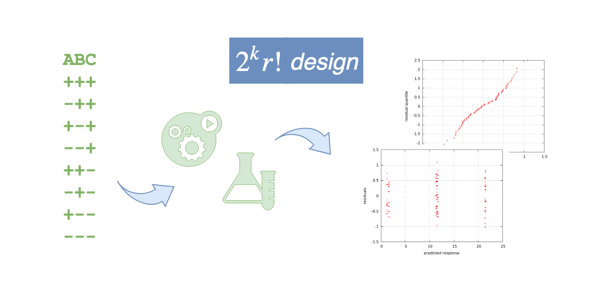
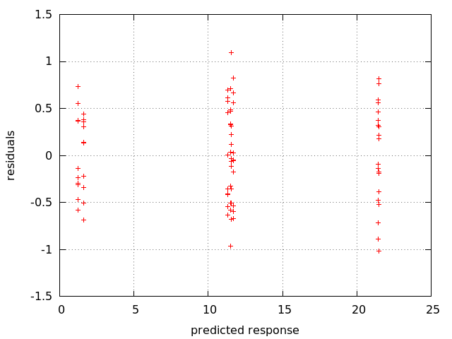
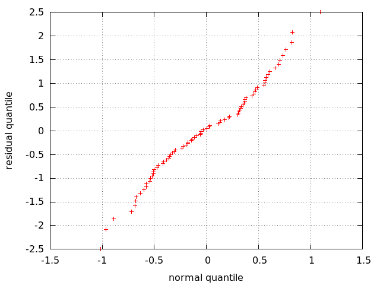

# factorial2kr

Python script to perform factorial 2^kr analysis.

## Background

For an intro on factorial 2 kr design see slides from Prof. Raj Jain [here](https://www.cs.rice.edu/~johnmc/comp528/lecture-notes/Lecture12_13.pdf) or just ask Google.

Very briefly, suppose you want to run a number of experiments (e.g., throwing a ball) to see what happens to a given metric of your interest (e.g., peak height reached by the ball after bouncing on the floor) and there are a number of parameters that might or might not affect significantly the response of your system (e.g., ball weight, ball size, ball color, weight of the person throwing the ball). Factorial 2^k r you design can help identifying _which_ parameters are really important, in a quantitative manner, as follows.

For every parameter select two limit case, in our example:

- ball weight (A): 50 grams (-) vs. 100 grams (+)
- ball size (B): 1 cm (-) vs. 3 cm (+)
- ball color (C): white (-) vs. black (+)
- weight of the person throwing the ball (D): 50 kg (-) vs. 80 kg (+)

Then you run _r_ experiments for every combination of the above parameters. We have _k = 4_ parameters (A-D), hence 2^_k_ combinations, which is 16. The total number of experiments will be 16 x _r_, e.g., with _r = 10_ it will be 160.

If you record all the values obtained in a text file, you can then give that to `factorial2kr.py`, which will tell you:

1. what is the relative importance of each parameter (likely ball weight and size matter a lot, whereas the color and weight of the person throwing the ball not so much)
2. how much the combined effect of every possible combination of parameters affect the response of the system
3. if the analysis performed is statistically significant

## Software

Dependencies:

- Python3
- scipy.stats module (see [here](https://www.scipy.org/install.html) for instructions on how to install)

## Usage

```
$ ./factorial2kr.py -h
usage: Compute effects and confidence intervals of a factorial 2kr design
       [-h] [--k K] [--residuals RESIDUALS] [--qqnorm QQNORM] [--sign_matrix]
       [--confidence CONFIDENCE] [--verbose] [--random RANDOM]
       [infile]

positional arguments:
  infile                input file with observations (default: None)

optional arguments:
  -h, --help            show this help message and exit
  --k K                 Number of parameters (default: 2)
  --residuals RESIDUALS
                        Name of the file where to save the scatter plot of
                        residuals. Ignore trend if the magnitude of residuals
                        is smaller than 1/10 of the magnitude of responses. If
                        the trend goes up or down then there are other factors
                        or side effects that are not accounted by the current
                        analysis. (default: )
  --qqnorm QQNORM       Name of the file where to save the normal Q-Q plot of
                        errors. The analysis is statistically significant if
                        the plot is approximately linear. (default: )
  --sign_matrix         Print the sign matrix and quit (default: False)
  --confidence CONFIDENCE
                        Confidence level (default: 0.9)
  --verbose             Verbose output (default: False)
  --random RANDOM       Generate a random input file whose observations depend
                        on the list of the given effects, e.g. --random AC
                        means that only A and C parameters have an effect on
                        the metric of interest (default: )
```

The `factorial2kr.py` script can be executed in three modes, described below.

### Sign matrix generation

If the option ``--sign_matrix`` is used, then the script just prints the so-called _sign matrix_, which gives the experimenter the order in which to sort their experiment.

For instance, with _k=3_:

```
$ ./factorial2kr.py --k 3 --sign_matrix
ABC
+++
-++
+-+
--+
++-
-+-
+--
---
```

This means that the input file of the script must contain 8 lines (= 2^3) arranges so that:

- in the first line all the parameters A to C have a _high_ value (+ sign)
- in the second line the parameter A has a _low_ value (- sign) whereas B and C have a _high_ value (+ sign)
- etc.

### Random generation

If you want to see how the `factorial2kr` works in pratice you can use the ``--random`` option, which generates a valid input file with random values, created so that the response of the system is only affected by the parameters specified by the user. For example:

```
$ ./factorial2kr.py --k 3 --random AC > rnd
```

will save in text file `rnd` a file with 8 rows (= 2^3) and 10 columns (this is _r_, which is always 10 in this mode) where the metric of interest is affected by parameters A and C, but not B. 

The file looks something like this:

```
20.46761808343816 21.270269864387927 20.95863400311218 21.89804392761988 21.218061754095473 21.119497009399986 21.366465786921992 21.673774147583995 21.97254691891878 20.74988524538146
11.777682906172611 11.963513239242214 10.49448432766159 10.66816819700832 11.436073154036311 12.236165056653176 11.989609991969886 12.04659566428581 12.145549346649942 11.817809716872096
21.053793042522045 21.139602726736484 21.86539472342517 21.652710959625097 22.267017244245185 20.97277446462106 20.596796331326907 21.008349502572614 21.05962797344626 21.163400490013338
10.8950544846309 11.926401298134074 10.64720595369497 12.333514798823558 11.066530514946557 11.652558945846467 11.559717984821297 11.500037415673043 11.277425793539614 10.844953082389534
11.532624432534504 11.267874884103342 11.500142649996171 11.024240373360785 11.951868983462848 12.039350964928886 11.294224254921687 12.28025979892407 11.563551066380523 12.23985231134461
2.0542668403679714 2.1788318514557097 1.6017186973636564 1.1144445595660368 2.1135755147011173 1.74459936028566 1.3157595477492998 0.5643707590891979 1.6917126762622052 0.8422283234330147
10.798118091004724 11.51492569334377 11.016300240202904 11.779156920122972 10.92415064184178 10.60341695763146 11.7308870335696 11.894615085122165 11.41417553237173 11.716255188675259
1.9058456422501528 1.1567636204877414 1.6673440659855996 1.5170234170356194 1.757108822694628 1.5547868298606202 2.4460481853867884 0.27624139384888324 1.7105899027411748 1.8222507071857597
```

### Normal operation

In this mode you perform factorial 2^k r analysis of the effects. Optionally, you may specify that the residual errors are plotted against the estimated response (`--residuals` option) or in a Q-Q normal plot (`--qqnorm` option).

Let's execute the script on random values generated as illustrated above:

```
$ ./factorial2kr.py --confidence 0.9 --residuals residuals --qqnorm qqnorm rnd
SSY 14575.067853968501
SST 4027.727810034832
SSE 19.185744707679685 0.48%
std dev 0.05771358987443417
q0 11.48223630436035 SS0 10547.34004393367 0.0% (9.82, 13.15)
qA 5.050571976475769 SSA 2040.6621831649886 50.67% (3.38, 6.72)
qB 0.0621256401688611 SSB 0.3087676133112647 0.01% (-1.6, 1.73) ***
qAB -0.09091871361239132 SSAB 0.6612969987945625 0.02% (-1.76, 1.58) ***
qC 4.958124016822681 SSC 1966.6395012955102 48.83% (3.29, 6.62)
qAC -0.03934704052608237 SSAC 0.12385516785289348 0.0% (-1.71, 1.63) ***
qBC 0.01706711816708309 SSBC 0.02330292180233421 0.0% (-1.65, 1.68) ***
qABC 0.03923617031723889 SSABC 0.12315816489307024 0.0% (-1.63, 1.71) ***
```

The most important part here are the rows starting with `q` because they tell you much the system is affected by the given component (e.g., `qA`, `qB`), combination of components (e.g., `qAB`, `qABC`) and the estimated response (`q0`). For every such value you also have an indication of the relative importante, expressed as a percentage, and the 90% confidence internal (argument ``--confidence`` to the script). If the line terminates with `***` it means that the statistics in that row are not stable and should not be considered.

In the example we see that we have an average response of `11.48`, which is due almost entirely to A and C alone, as expected based on how we built the random numbers. The actual numbers will change, of course, upon multiple executions of the script with ``--random`` but the trend will remain the same.

Here is the scatter plot of residuals, which does not show any clear trend, as expected:



And here is the Q-Q normal plot of residuals, which looks linear, as expected:



If you want to use the same values used in [this](https://www.cs.rice.edu/~johnmc/comp528/lecture-notes/Lecture12_13.pdf) presentation you can run the script on `test_input`, which is included in the repo.

## Heritage preservation

In the directory `historical` you find a mirror of the [Factorial2k](http://cng1.iet.unipi.it/wiki/index.php/Factorial2kr) tool, which can be used
to realise factorial 2^k r design using an unmaintained framework called [ANSWER](http://cng1.iet.unipi.it/wiki/index.php/ANSWER) originally developed as a plug-in of the [Network Simulator - ns2](https://www.isi.edu/nsnam/ns/).

The framework assumes that the raw data to perform the analysis are stored in binary files serialized using a proprietary undocumented structure.

To compile the tool (for example in debug mode using compiler clang++):

```
cd build/debug
../buildme.sh clang++
make
```

This will generate the executable `src/main`, which is intended to be launched from `scripts/launch.py`, also poorly documented but shipped with a configuration file example `scripts/factorial.xml`.

The tool has been tested under Linux (compiled with g++-5.4.0) and Mac OS X (compiled with Apple LLVM 10.0.1).
